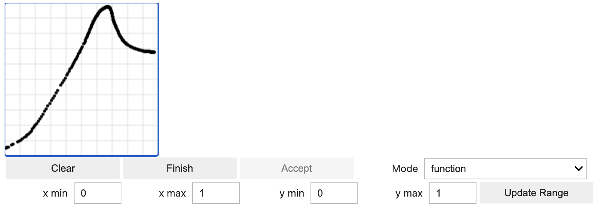
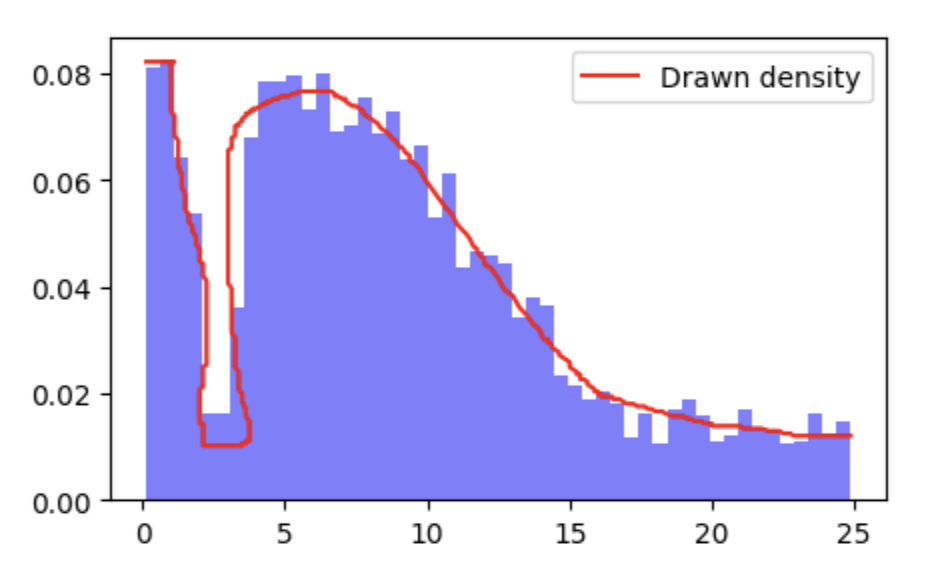
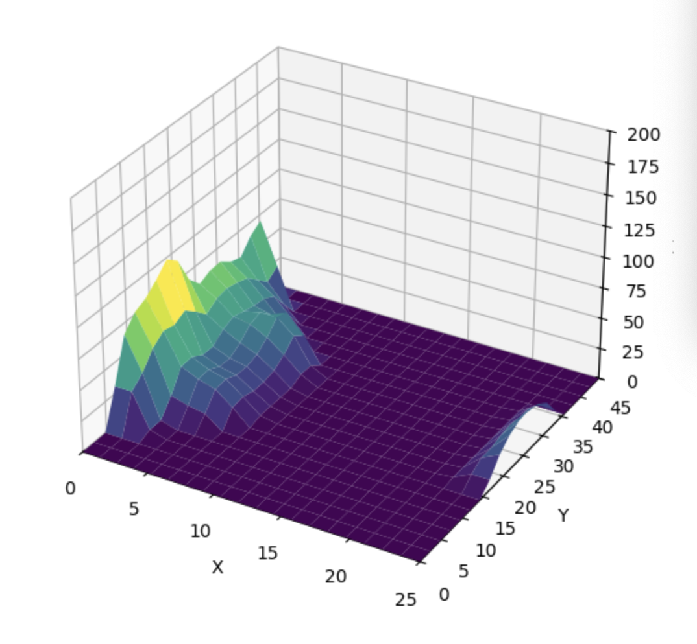
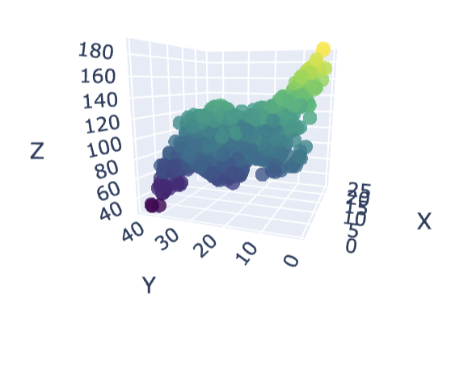

# Sketulate

**Sketulate** is a Python package for interactive function, surface, and density simulation directly in Jupyter notebooks. Draw functions, surfaces, or densities with your mouse, convert them into callable functions or interpolators, and simulate data for experiments, modeling, or teaching.

## Features

- Draw univariate functions interactively (`Sketulate`)  
- Draw 2D surfaces / interactions (`SketulateInteraction`)  
- Linear ND interpolation with linear extrapolation for surfaces  
- Works seamlessly in Jupyter Notebook and JupyterLab  
- Easy integration for synthetic data generation  

## Installation

```bash
pip install sketulate

## Quick Example
from sketulate import Sketulate, SketulateInteraction

# Draw a univariate function
f1 = Sketulate(x_min=0, x_max=10, y_min=-5, y_max=5)
f1.sketch()


f1.accept(callback)  # After drawing, click Accept
# F1 is a now a ready to use function via
f1.f
# Or a custom density distribution (selected in the canvas dropdown) via

f1.g

# Draw an interaction surface
f3 = SketulateInteraction(x_range=(0,10), y_range=(0,10), z_range=(-5,5), grid_size=5)
f3.sketch()  # Interactive surface with sliders


- Put it all together and easily simulate some data


